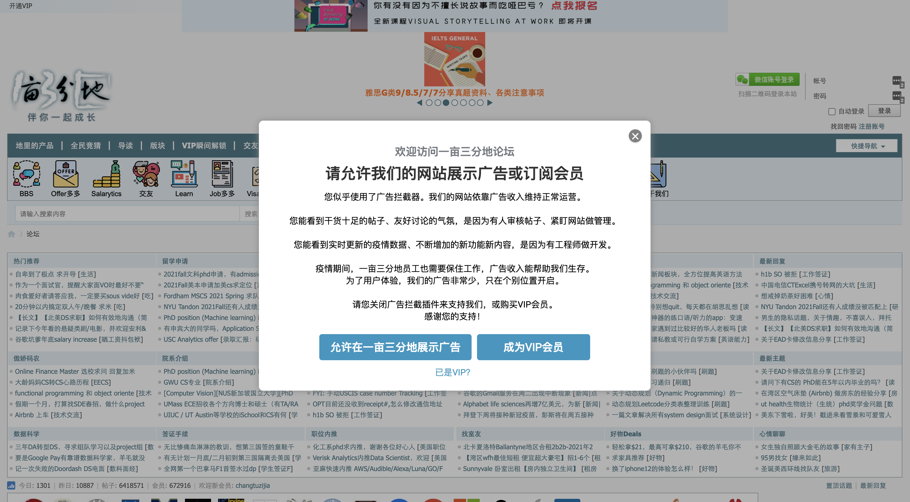

# Unblock Adblock on 1Point3Acres (一亩三分地)

A chrome extension that automatically removes the Adblock warning message on 1Point3Acres website.

## Installing

1. Download and open this repository on your local machine.
2. Launch Google Chrome browser. Visit `chrome://extensions/`.
3. Drag and drop `1point3acres_UnblockAdblock` folder over the Chrome extension page.

## Behind the scene

Once 1Point3Acres bbs page loads, this extension looks for the pop-up and blocked elements every 10 ms. Then it removes the pop-up and unblocks the webpage.

Retrieving the DOM elements is a low-cost operation, and the blocking elements usually show up within seconds. Most likely you will still see those elements before they quickly disappear.

## License

This project is licensed under GNU General Public License v3.0 - see the [LICENSE](LICENSE) file for details
